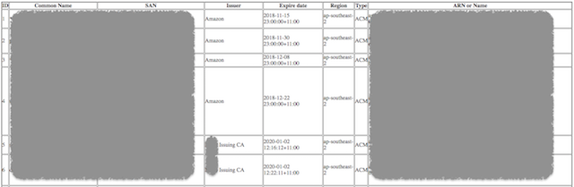

# CertStuff

## Description
CertStuff is a tool that checks the certificates in AWS and Akamai.

## Credentials
The AWS and Akamai crentials are passed from environment variables. Set it up before you run the tool.
```bash
# AWS credential
export AWS_ACCESS_KEY_ID="***************" 
export AWS_SECRET_ACCESS_KEY="***************"
# Akamai credential
export AKAMAI_CPS_ACCESS_TOKEN="***************"
export AKAMAI_CPS_CLIENT_SECRET="***************"
export AKAMAI_CPS_CLIENT_TOKEN="***************"
export AKAMAI_CPS_CONTRACT_ID="***************"
export AKAMAI_CPS_URL="***************"
```


## Usage
```bash
usage: certstuff.py [-h] [--aws] [--akamai]

optional arguments:
  -h, --help  show this help message and exit
  --aws       List issued certificates in AWS
  --akamai    List production certificates in Akamai
```

## Sample output

